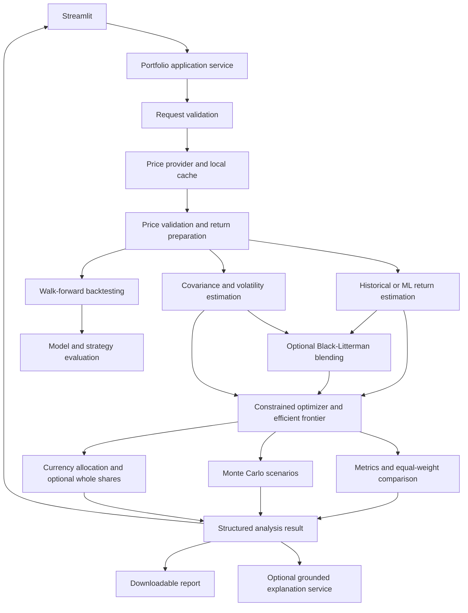

# Intelligent Portfolio Optimizer

## Design

Build a modular Python application with a thin Streamlit interface. The core runs without Streamlit or a network connection when supplied recorded data. Use functions for calculations and small interfaces for external services. A single application service coordinates the pipeline; individual components do not call the UI or silently fetch data.

Start with historical return estimates, shrinkage covariance and Markowitz optimization. Add XGBoost, LightGBM, GARCH, LSTM and Black-Litterman behind the same contracts after the baseline is validated. Model complexity is justified by out-of-sample evidence, not presumed accuracy.



## Shared contracts and conventions

- `PortfolioRequest`: ordered unique tickers, investment amount, currency, historical window, investment horizon, risk setting, maximum asset weight and estimator choice. Validate finite positive amount, supported risk setting, feasible constraints and dates. Start with equities in one currency, long-only, fully invested portfolios.
- `PriceDataset`: date-indexed adjusted closing prices with ticker columns; include provider, retrieval time, currency and adjustment policy. Do not mix adjusted and unadjusted prices. Reject mixed currencies unless explicit FX conversion is implemented.
- `PreparedData`: aligned simple daily returns and cleaned prices, plus a quality report. Do not forward-fill returns or silently remove a requested stock. Define a common trading window and a minimum observation count.
- `MarketEstimates`: expected annual simple returns, annual covariance, daily forecast volatilities if available, ticker order, estimation cutoff, forecast horizon and method metadata. All inputs must share asset order and units. Keep log-return forecasting internal and convert explicitly when necessary.
- `OptimizationResult`: weights indexed by ticker, expected return, volatility, objective, solver status, constraints and frontier points.
- `AnalysisResult`: request, data quality, estimates, portfolio, equal-weight comparison, scenario summary, currency allocations, optional backtest and warnings. It is the sole input to UI charts, reports and explanations.

Use a configurable trading-day convention (initially 252), one configurable annual risk-free rate, and an explicit random seed. Store data cutoff, forecast horizon and calculation assumptions in every result. Risk tolerance controls risk aversion in an objective such as `mu.T @ w - lambda * (w.T @ Sigma @ w)`; it is not a probability of losing money. Investment amount scales currency allocation, while normalized weights depend on the risk and asset constraints. Expected metrics and realized backtest metrics must have distinct labels.

## Components and unit tests

| Component | Responsibility and contract | Unit verification |
|---|---|---|
| Configuration and request validation | Validate requests and numerical assumptions before calling providers | Invalid/zero/NaN amount; duplicate tickers; reversed dates; invalid horizon; mixed currencies; impossible weight caps; valid boundary requests |
| Price provider | `fetch_prices(request) -> PriceDataset`; yfinance adapter behind a provider interface | Mock provider response; missing ticker; empty response; timeout; normalize one/many ticker response layouts; preserve adjusted-price policy |
| Cache | Store price snapshots keyed by tickers, dates, adjustment policy and provider version | Cache hit bypasses provider; miss fetches; expiration refreshes; corrupt entries rejected; different adjustment policies have different keys |
| Preparation | Validate prices and calculate aligned daily returns | Hand-calculated returns; sorted/unique dates; positive finite prices; missing observations; insufficient common history; no invented trading days; quality report identifies exclusions |
| Feature engineering | Build lagged returns, rolling volatility and other causal features with future-return labels | Tiny fixture with exact rolling values; no future rows in features; target horizon correct; rolling warm-up removal; labels unavailable at training cutoff excluded |
| Historical return estimator | Annualized baseline expected returns | Constant-return fixture; asset order; annualization convention; finite outputs; insufficient-history failure |
| ML return estimator | Train/predict per asset using chronological evaluation; interchangeable XGBoost/LightGBM adapters | Mock estimator verifies feature/target alignment and train cutoff; prediction shape; deterministic seeded fit smoke test; training-only preprocessing; incompatible saved model rejected |
| Covariance estimator | Estimate a stable annual covariance matrix from aligned returns | Symmetry; finite values; positive semidefiniteness within tolerance; ticker order; constant/collinear series; diagonal agrees with estimated variances |
| Volatility estimator | Baseline rolling volatility, then GARCH/LSTM adapters | Forecast horizon and units; finite nonnegative forecast; reproducibility; fitting failure; short histories; invalid forecasts rejected |
| Covariance assembly | Combine forecast volatilities with a valid estimated correlation matrix: `Sigma_daily = D @ Corr @ D` | Diagonal equals forecast variance; symmetry; PSD; ticker alignment; annualization; documented handling of zero-variance assets |
| Black-Litterman | Blend a prior with explicit views and uncertainty; return posterior estimates | No views preserves prior; dimension validation; view direction; uncertainty changes influence; singular inputs handled; prior assumptions recorded |
| Portfolio optimizer | Solve constrained long-only mean-variance objective from estimates | Weights sum to one; bounds/caps respected; finite results; symmetric assets yield equal weights; simple known optimum; infeasible request; solver failure/status handling |
| Efficient frontier | Solve minimum variance for feasible target returns under the same constraints | Endpoints within feasible bounds; every returned point satisfies constraints; identical estimates produce degenerate-frontier handling; infeasible points flagged |
| Allocation | Convert weights to currency amounts; optionally whole shares and residual cash | Currency amounts sum to budget within rounding tolerance; whole-share cost never exceeds budget; fractional weights/zero weights; expensive shares; cash and realized weights included |
| Metrics and benchmark | Expected return/volatility/Sharpe and equal-weight reference; realized metrics computed separately | Hand-calculated mean/variance; risk-free rate; zero volatility produces undefined Sharpe with explanation; benchmark uses identical assets and dates; log/simple-return consistency |
| Walk-forward backtest | Evaluate estimation and rebalancing through time with transaction costs | Training ends before test period; horizon labels mature before training; orders use a defined next tradable price; weights drift between rebalances; known fixture equity curve; turnover and costs reduce net wealth correctly |
| Monte Carlo | Generate seeded correlated return scenarios and summarize terminal wealth | Same seed reproduces; dimensions and quantile ordering; zero-volatility deterministic case; sample moments approximately match assumptions; positive prices when using lognormal simulation; horizon convention |
| Application service | Coordinate components into `AnalysisResult` | Fake providers/estimators; correct call order and data cutoff; consistent asset alignment; errors propagate clearly; explicit fallback metadata; optional services absent |
| Charts and reports | Render/export existing result without recomputing finance | Chart labels and series match fixture result; report contains assumptions and allocations; failures do not discard analysis |
| Optional LLM explanation | Explain existing result; optionally parse user intent into a validated request | Mock API; grounded prompt includes supplied figures; invalid parsed requests rejected; untrusted text treated as data; timeout; UI always displays authoritative computed figures |
| Streamlit | Collect inputs, run service on explicit submission, display results | App smoke test; invalid request; successful fixture result; provider error; input change invalidates displayed result; rerun avoids duplicate model training |

Unit tests use tiny, readable fixtures with expected values, deterministic seeds and mocks at external boundaries. Do not call Yahoo Finance or an LLM API during unit tests. Do not assert that an ML model always outperforms equal weighting. Statistical tests have justified tolerances rather than exact sample equality.

## Financial and modelling decisions

1. Freeze the forecast horizon before engineering labels. A daily return forecast, a monthly forecast and an annual optimizer input need explicit conversions and assumptions; they cannot be substituted directly.
2. Estimate cross-asset correlation alongside volatility. GARCH or LSTM forecasts for individual stocks alone are insufficient to optimize portfolio risk. Use a shrinkage covariance baseline. The optional `D @ Corr @ D` approach assumes the estimated correlation remains applicable over the forecast horizon.
3. Keep Black-Litterman optional until the prior is defined. Record the reference weights, risk-aversion parameter, tau, views and view uncertainty. Equal reference weights can be an educational proxy but must not be described as market-cap equilibrium weights.
4. Limit concentration with a configurable cap; validate feasibility (`number_of_assets * cap >= 1`). Report unsuccessful solver states instead of returning invalid weights. Any fallback estimator must be explicit in the result.
5. First compare strategies on identical chronological splits and rebalance schedules, including turnover and costs. Use forecasting error and realized risk-adjusted performance as separate evaluation criteria. Tune exclusively within the training period.
6. Monte Carlo plots describe outcomes under a stated distribution model; they are not measured probabilities of future market outcomes. Keep simulation assumptions in the report.
7. Add optional features only after the baseline passes end-to-end checks. LSTM is a candidate model, not a dependency required for the application to start.

## Repository layout

```text
app.py
pyproject.toml
src/portfolio_optimizer/
    config.py
    contracts.py
    errors.py
    data/
        provider.py
        yahoo.py
        cache.py
        preparation.py
    forecasting/
        features.py
        returns.py
        volatility.py
        covariance.py
        black_litterman.py
    optimization/
        solver.py
        frontier.py
        allocation.py
    evaluation/
        metrics.py
        backtest.py
        simulation.py
    services/
        analysis.py
        reports.py
        explanations.py
    ui/
        inputs.py
        charts.py
        results.py
tests/
    fixtures/
    unit/
    integration/
    acceptance/
```

Keep base dependencies separate from optional ML, LSTM and LLM dependencies. Start with pytest, NumPy/pandas, a covariance estimator, cvxpy, yfinance, Plotly and Streamlit. Avoid a database, microservices or background queue until there is a demonstrated need; a local price cache is sufficient initially.

## Implementation sequence and completion gates

| Stage | Build | Completion gate |
|---|---|---|
| 1 | Project setup, contracts, configuration and request validation | Unit suite runs; sample valid/invalid requests covered |
| 2 | Recorded price fixture, provider adapter, preparation and cache | Provider/preparation tests pass; fixture produces expected aligned returns; optional manual live-fetch check |
| 3 | Historical returns, shrinkage covariance and baseline metrics | Hand-calculated fixtures match; units/order/PSD checks pass |
| 4 | Optimizer, frontier, currency allocation and equal-weight reference | Known optimization fixtures pass; constrained fixture pipeline produces a complete result |
| 5 | Walk-forward backtest and Monte Carlo | Leakage/cost fixtures pass; seeded simulation passes; evaluation assumptions recorded |
| 6 | Application service and downloadable report | Offline integration test covers request through report, plus failure paths |
| 7 | Initial Streamlit UI | User can submit fixture-backed analysis and view allocation, metrics, frontier, scenarios and report; UI smoke tests pass |
| 8 | XGBoost/LightGBM, then GARCH, optional LSTM and Black-Litterman | Each adapter passes contract tests; chronological evaluation documented; UI uses same service contract |
| 9 | Optional LLM interface and final integration | Explanation failure leaves numeric analysis usable; acceptance scenarios pass |

The initial UI is integrated after core calculations pass. The final UI adds advanced models through the existing service, without duplicating calculations in widget code.

## Integration and acceptance checks

- **Offline integration:** fixed request + recorded prices -> preparation -> estimates -> optimizer -> evaluation -> allocations -> report. Assert asset identity, units, feasible weights, budget conservation and provenance.
- **Adapter integration:** exercise the actual estimator and solver libraries on a small fixture. Keep separately marked live-provider tests outside the default deterministic suite.
- **Backtest integration:** replay multiple cutoffs and prove that every training observation and target was available at that cutoff. Compare baseline, ML and equal-weight strategies under identical execution rules.
- **Acceptance:** valid request; low/medium/high risk on a suitable fixture; missing ticker; insufficient history; infeasible cap; provider failure; optimization failure; report download; optional LLM failure. Do not require monotonic risk across all possible real datasets—verify the chosen risk objective and explain boundary solutions.
- **Performance:** measure fetch, feature creation, fitting, optimization and render time separately. Cache by complete input/configuration keys, and ensure Streamlit reruns do not accidentally trigger expensive work.

## Current environment

Stages 1–7 are implemented: project packaging, contracts, configuration, validation, data providers/cache/preparation, baseline estimation, expected metrics, constrained optimization, frontier, currency allocation, backtesting, realized metrics, Monte Carlo, the application service, report exports and Streamlit. All 307 tests pass, including 16 Streamlit acceptance tests and the offline request-through-downloadable-report integration test. `examples/baseline.py` exercises the core on synthetic prices; `examples/service_report.py` exports HTML/JSON/ZIP artifacts. `app.py` provides demo and Yahoo modes, interactive Plotly charts, input controls and report downloads. Core errors are fatal; optional evaluation failures are recorded unless strict evaluation is requested.

UI calculations run only on explicit submission. Results and download bytes are retained in session state for reruns. Changes to input identity invalidate both; failed submissions remove prior results. Report retries do not rerun analysis. AppTest covers these lifecycle rules. Local server startup/health and a headless Chrome demo submission were verified; the screenshot is `artifacts/dashboard-preview.png`.

Live Yahoo fetching was verified on 6 October 2026 for candidate Indian stocks and the default historical window. Exchange calendar validation is deferred: completely absent trading sessions cannot yet be distinguished from holidays. Backtesting rejects missing prices or removed return rows. The service translates cache I/O failures to ProviderError. Whole-share allocations remain optional future work.

Backtesting delays execution by one observed session, records training cutoffs and applies self-financing fees to actual traded notional. Both strategies use identical schedules and costs. Monte Carlo matches daily moments to correlated lognormal gross returns when mathematically compatible, with fixed moments, IID sessions and buy-and-hold weights. Incompatible log covariances fail explicitly. These assumptions are stored in results. Advanced ML label maturity and training-only tuning will be implemented with the ML adapters.

A Python 3.12 virtual environment is available at `.venv`; its managed interpreter lives under `/private/tmp/portfolio-python`. Recreate it with a persistent interpreter if temporary files are cleared. The system `/usr/bin/python3` still exits with a missing Apple developer tools error. Run tests with `.venv/bin/python -m pytest`. Start the dashboard with `.venv/bin/python -m streamlit run app.py --server.address 127.0.0.1`. Advanced return/volatility estimators and Black-Litterman are the next stage; the optional LLM remains later work.

The historical baseline is labeled explicitly in the dashboard and reports. Nonpositive historical means and means below the configured reference rate receive a portfolio assessment explaining full investment and the absence of ML forecasts. Values remain unchanged. Cash allocation is not implemented.
