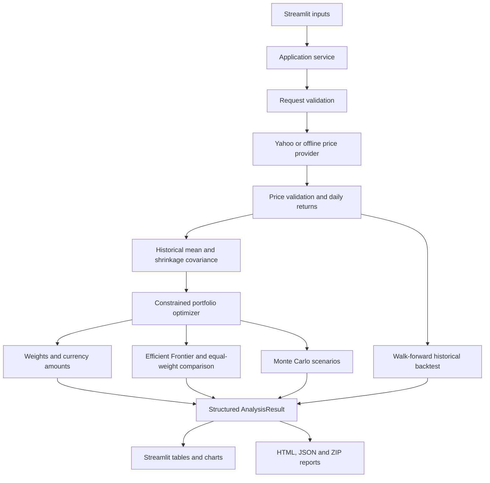

# Intelligent Portfolio Optimizer — Implementation and Explanation Report

**Project:** Intelligent Portfolio Optimizer  
**Implementation reviewed:** 6 October 2026  
**Purpose:** Explain the current application, its calculations, architecture, performance and validation during a project presentation or viva.

## 1. Project overview

The Intelligent Portfolio Optimizer is a Python application with a Streamlit dashboard. It helps a user explore how to divide an investment amount across selected stocks while balancing estimated return against risk. It also compares the allocation with equal weighting, replays historical performance with transaction costs, and simulates possible future portfolio values under stated statistical assumptions.

The user supplies stock symbols, investment amount, risk appetite, a maximum weight per stock, a historical window and a simulation horizon. The application produces stock weights, currency allocations, portfolio statistics, an Efficient Frontier, historical backtest results, simulation summaries and downloadable reports.

**Current implementation status:** The working system is a historical statistical baseline. It uses historical arithmetic return estimates, Ledoit–Wolf covariance estimation and constrained mean–variance optimization. XGBoost, LightGBM, GARCH, LSTM, Black–Litterman and the optional LLM interface are planned extensions and are **not currently used to calculate the displayed results**.

A suitable introduction for the professor is:

> “I have implemented and tested the complete historical-data portfolio pipeline, including optimization, backtesting, simulation and Streamlit integration. This provides the baseline against which the proposed machine-learning models will be evaluated.”

## 2. The problem being addressed

Selecting stocks and allocating money are separate decisions. Even when a user has selected several stocks, dividing the budget equally does not account for differences in volatility or relationships between the stocks.

This project automates the allocation step. It estimates return and covariance from a common historical dataset, applies portfolio constraints, and makes the resulting risk–return trade-off visible. Historical replay and an equal-weight benchmark help assess what the allocation strategy actually achieved under the implemented execution assumptions.

The system is an educational decision-support tool. It does not place trades or provide a guarantee of future profitability.

## 3. Tools and technologies actually used

| Tool | Role in the application | Installed version during this review |
|---|---|---|
| Python | Core application, validation, service coordination and exports | 3.12.15 |
| NumPy | Array operations, matrix calculations, random scenarios and numerical checks | 2.5.3 |
| pandas | Date-indexed prices, aligned returns, labeled matrices and tables | 3.0.6 |
| yfinance | Retrieves historical adjusted prices and currency metadata from Yahoo Finance | 1.7.0 |
| scikit-learn | Supplies the Ledoit–Wolf covariance estimator | 1.9.1 |
| CVXPY | Expresses and solves the constrained portfolio optimization problem | 1.9.3 |
| CLARABEL | Default numerical solver used through CVXPY | 0.11.1 |
| Streamlit | Input widgets, dashboard, session state and downloads | 1.65.0 |
| Plotly | Interactive allocation, frontier, scenario and backtest charts | 7.1.0 |
| pytest | Unit, integration and application acceptance tests | 8.4.2 |
| Python standard library | Dataclasses, Decimal currency amounts, JSON, CSV, ZIP, timestamps and file handling | Included with Python |

The project is packaged using `pyproject.toml` and setuptools. Dependencies are separated into data, analysis, optimization, UI and optional advanced-model groups.

There is no database, trading broker connection, separate REST backend or GPU training requirement in the current implementation. Files store the price cache; Streamlit holds each user's current result in session state.

The optional `ml` and `lstm` dependency groups describe future capabilities. Their presence in the package configuration does not mean those models have been implemented or used.

## 4. Architecture and separation of responsibilities



The important architectural decision is that the UI does not fit models or solve portfolios. It collects inputs, calls `PortfolioAnalysisService.analyze()`, and displays the returned `AnalysisResult`. The core can therefore be tested without opening a browser.

| Location | Responsibility |
|---|---|
| `app.py` | Streamlit entry point |
| `config.py`, `contracts.py`, `validation.py`, `errors.py` | Numerical conventions, requests, input checks and expected failures |
| `data/` | Provider interface, Yahoo adapter, offline/demo providers, cache and preparation |
| `forecasting/` | Historical means, covariance estimation and validated market estimates |
| `optimization/` | Portfolio solver, Efficient Frontier and currency allocation |
| `evaluation/` | Expected metrics, baseline assessment, realized metrics, backtesting and simulation |
| `services/` | End-to-end analysis coordination and report exports |
| `ui/` | Streamlit inputs, charts, result rendering and session lifecycle |
| `tests/` | Unit, integration and UI acceptance tests |
| `examples/` | Runnable offline analysis and report-generation examples |

Frozen dataclasses describe the contracts between modules. pandas objects inside them are still mutable, so critical calculation boundaries validate them and copy data where appropriate. Asset labels and order are checked explicitly to prevent a stock's return estimate from being combined with another stock's weight or covariance row.

## 5. Step-by-step analysis pipeline

### 5.1 Collect and validate inputs

The dashboard accepts:

- Data source: synthetic demo or Yahoo Finance.
- Stock symbols and one analysis currency, currently INR or USD.
- Investment amount.
- Low, medium or high risk appetite.
- Maximum portfolio weight for any individual stock.
- Historical start and end dates.
- Simulation horizon and scenario count.
- Optional backtest training window, rebalance frequency and transaction costs.
- Annual risk-free reference rate and random seed.

Validation rejects invalid amounts, duplicate symbols, invalid dates and impossible constraints. If there are three stocks and each is capped at 20%, the portfolio can hold only 60% of the budget, so it cannot satisfy the full-investment constraint. In general:

```text
number_of_stocks × maximum_asset_weight >= 1
```

The UI supplies the current date in Asia/Kolkata so future historical windows are rejected consistently. Currency allocations require amounts with at most two decimal places.

### 5.2 Retrieve historical prices

The Yahoo adapter requests daily prices with `auto_adjust=True`. It extracts the adjusted `Close` field, handles single-stock and multi-stock response layouts, and preserves the requested asset order.

The application's end date is inclusive. Yahoo's download end date is exclusive, so the adapter sends the following calendar day as the API end date. Asset currency metadata is checked separately; the program does not infer currency solely from a symbol suffix.

Adjusted prices account for provider-supplied corporate-action adjustments. They are used consistently for return analysis. They are not treated as executable whole-share purchase quotes.

The demo provider supplies a deterministic synthetic dataset for three fictional assets. It permits a complete demonstration without a network connection. Demo results are labeled as synthetic throughout the UI.

### 5.3 Cache the price snapshot

`CachedPriceProvider` saves a versioned JSON snapshot under `.cache/prices/`. Its default lifetime is six hours, measured from cache creation.

The key includes tickers, requested dates, currency, provider version and adjustment policy. Investment amount and risk appetite do not affect historical prices, so they do not belong in the price-cache key.

A valid hit bypasses the provider. Expired or corrupt entries trigger another fetch. Cache files are replaced atomically, reducing the chance of reading a partly written document. Provider failures do not cause the application to serve expired data silently.

### 5.4 Validate and prepare prices

Preparation checks that dates are valid and unique, prices are numeric, observed prices are positive and finite, all requested stocks are present, and asset currencies match the requested currency. It sorts rows and preserves ticker order.

The simple return for stock i on session t is:

```text
r[i,t] = P[i,t] / P[i,t-1] - 1
```

For example, a price increase from ₹100 to ₹110 produces a simple return of 10%.

Returns are calculated **before** incomplete observations are removed, with forward filling disabled. If a stock is missing a price on one row, that row's return and the following row's return are unavailable. Removing the missing price first would incorrectly present a change across multiple sessions as one daily return.

The data-quality report records missing prices, excluded return dates and the number of usable observations. The normal minimum is 60 aligned return observations. Weekend and holiday rows are not manufactured.

### 5.5 Estimate the historical return vector

For each stock, the baseline averages the usable daily simple returns and annualizes the average using 252 trading sessions:

```text
annualized_mean[i] = mean(daily_simple_returns[i]) × 252
```

If the daily mean is 0.05%, the annualized arithmetic mean is approximately 12.6%.

This is a historical arithmetic estimate. It is not the stock's compounded historical growth rate, a prediction of next year's profit, or a net return after taxes and fees. The dashboard therefore labels it **Historical mean return (annualized)**.

### 5.6 Estimate covariance and portfolio risk

Volatility describes variation in one asset's returns. Covariance also describes how different assets move together. Portfolio risk therefore requires a matrix, not just one volatility value per stock.

The implementation uses centered Ledoit–Wolf shrinkage covariance. Conceptually:

```text
shrunk_covariance = (1 - alpha) × empirical_covariance
                   + alpha × average_variance × identity_matrix
```

The library estimates the shrinkage coefficient `alpha`. Shrinkage regularizes an empirical covariance matrix, which can otherwise be unstable when assets are correlated or the sample is limited. This implementation uses the estimator's population normalization and records its coefficient in the result.

Daily covariance is annualized as:

```text
annual_covariance = daily_covariance × 252
```

The matrix is checked for matching asset order, finite values, symmetry, nonnegative diagonal variances and positive semidefiniteness within numerical tolerance. Tiny numerical negative eigenvalues can be corrected for solving; materially invalid matrices are rejected.

Annualization assumes daily moments remain applicable and does not explicitly model serial correlation.

### 5.7 Solve the allocation problem

Let `w` be the vector of weights, `mu` the annualized historical mean vector, `Sigma` the annual covariance matrix and `lambda` the risk-aversion parameter. The objective is:

```text
maximize: muᵀw - lambda × wᵀSigma w

subject to:
    sum(w) = 1
    w[i] >= 0
    w[i] <= maximum_asset_weight
```

This is a constrained convex quadratic optimization problem. CVXPY represents it and CLARABEL solves it.

The default risk mapping is:

| Risk setting | Risk-aversion parameter |
|---|---:|
| Low | 10 |
| Medium | 3 |
| High | 1 |

A larger parameter penalizes variance more strongly. High risk reduces this penalty; it does not promise a positive return. These values are configurable initial settings, not calibrated investor suitability scores.

The optimizer maximizes mean–variance utility, not Sharpe ratio. Only accurately optimal solver status is accepted. Solver weights are independently checked; only small numerical residuals are corrected by projection onto the capped simplex.

The investment amount scales the resulting currency allocations. It does not change normalized weights when the other inputs and constraints are unchanged.

### 5.8 Calculate portfolio statistics

The estimated portfolio mean and volatility are:

```text
portfolio_mean = muᵀw
portfolio_variance = wᵀSigma w
portfolio_volatility = sqrt(portfolio_variance)
historical_Sharpe_estimate = (portfolio_mean - annual_reference_rate)
                            / portfolio_volatility
```

For zero estimated volatility, Sharpe is returned as undefined rather than infinity.

The current numerical configuration defaults to a zero reference rate, while the dashboard initially displays a configurable 4% rate. The reference rate is a user-supplied analysis assumption, not a verified investment product.

If the allocation's historical mean is nonpositive or below the configured reference rate, the dashboard and report display an explicit assessment. Because the current optimizer requires full investment in the selected stocks and does not include cash, it can produce an allocation with a negative historical mean. Negative values are retained rather than hidden or replaced.

### 5.9 Construct the Efficient Frontier

The frontier first finds the global minimum-variance portfolio. It then computes the maximum return feasible under the same weight cap and solves minimum-variance problems for intermediate return targets.

This traces the efficient upper branch. The standard dashboard requests 20 points. Each target is a lower bound on return. A basket with identical return estimates or constraints that force one portfolio may yield a single frontier point. Failed solutions are reported rather than silently omitted.

### 5.10 Convert weights into currency amounts

Ideal funding for each asset is its weight multiplied by the investment amount. Decimal arithmetic and largest-remainder rounding convert these ideals into amounts with two decimal places while preserving the total budget exactly.

For ₹100 divided equally across three assets, the funding amounts can be ₹33.34, ₹33.33 and ₹33.33.

Both target weights and rounded weights are recorded. Rounding can slightly change the percentages. These are currency funding allocations; executable whole-share quantities are not implemented.

## 6. How historical backtesting works

The final portfolio uses the entire selected history for estimation. The backtest is separate: it reconstructs a sequence of decisions using a rolling window of earlier returns.

The dashboard defaults are a 60-session estimation window, rebalancing every 21 sessions and fees of 10 basis points, equal to 0.1% of traded notional.

The execution timeline is deliberately delayed:

```text
Close t:     calculate a signal using returns available through t
Close t+1:   execute the allocation
Session t+2: new holdings first earn a close-to-close return
```

Existing holdings earn the execution day's return before rebalancing. Weights drift between rebalances as prices change. The maximum asset weight applies to rebalance targets; subsequent market moves can change actual weights.

Transaction costs are self-financing:

```text
cost = fee_rate × sum(abs(new_asset_values - old_asset_values))
new_asset_values = target_weights × (wealth_before_trade - cost)
```

The program solves this equation numerically and records fees, turnover and traded notional. At initial entry, invested wealth is `budget / (1 + fee_rate)`.

Both optimized and equal-weight strategies use the same assets, evaluation dates, schedule and fee rate. No terminal liquidation fee is charged. Replay assumes fractional holdings and adjusted-close return accounting; slippage and taxes are excluded.

Histories containing missing prices or removed return rows are rejected for replay, because skipping a holding-period return would distort wealth.

Realized metrics include:

- Total compounded net return.
- Annualized geometric net return, using evaluation-session count.
- Annualized arithmetic mean and sample volatility.
- Realized Sharpe based on daily excess returns and sample standard deviation.
- Maximum drawdown, including initial wealth before entry fees.

For `L` evaluation observations:

```text
annualized_geometric_return = (product(1 + net_session_returns))^(252/L) - 1
```

This after-fee replay measure is different from the dashboard's historical arithmetic estimate. Annualized statistics from short evaluation windows can be unstable.

## 7. How Monte Carlo simulation works

The simulator generates correlated lognormal daily gross returns. It converts annualized means and covariance back to daily moments, then matches those moments to lognormal parameters:

```text
gross_mean = 1 + daily_simple_return_mean
log_covariance[i,j] = log(1 + daily_covariance[i,j]
                             / (gross_mean[i] × gross_mean[j]))
log_mean[i] = log(gross_mean[i]) - log_covariance[i,i]/2
```

It draws correlated normal shocks, adds the log mean, exponentiates, and compounds each asset's growth. Portfolio wealth is computed from the initial asset weights and accumulated asset growth. Weights drift because this is a buy-and-hold simulation.

The dashboard initially uses 1,000 scenarios, a 21-trading-day horizon and seed 42. The service's standalone default is 2,000 scenarios. Repeating a run with the same inputs, seed and numerical environment reproduces its paths.

Results include 5th, 25th, 50th, 75th and 95th wealth percentiles, mean terminal wealth and the fraction of scenarios ending below the initial budget. That fraction is a **model loss frequency**, conditional on assumptions, not a measured probability of future market loss.

Assumptions include independent sessions, fixed moments, no changing volatility regime, fractional holdings and no trading fees or taxes. Incompatible moment-matched log covariance matrices cause an explicit failure. Numerical overflow and nonpositive wealth are rejected. Stored scenario values are limited to 10 million to bound memory use.

## 8. Why the application analyzes quickly

### 8.1 The current calculations are small

The default portfolio has three assets. Its covariance matrix contains nine entries and each portfolio solve has three weight variables. Around two years of daily history is roughly 500 return observations. These are small numerical problems for a modern CPU.

### 8.2 NumPy and pandas process arrays

Mean calculations, covariance operations and scenario updates use array operations rather than Python loops over every individual price. Numerical libraries perform much of this work in compiled routines. Simulation advances through days while updating all scenarios together in arrays.

### 8.3 The solver handles a convex problem

CVXPY delegates the small quadratic program to CLARABEL. The implementation does not enumerate every possible stock-weight combination. The frontier repeats small constrained solves, normally 20 of them.

### 8.4 There is no expensive predictive-model training yet

The baseline recomputes means and fits a statistical covariance estimator. It does not train XGBoost, LightGBM or an LSTM, fit GARCH, or call an LLM API. This is an important reason for its speed.

The backtest's “training window” currently means a historical estimation window. It is not a deep-learning training process.

### 8.5 Two different reuse mechanisms reduce repeated work

**Price cache:** A valid six-hour snapshot avoids another market download for the same price request. This persists on disk.

**Streamlit session state:** After explicit analysis, the application keeps the result and prepared download bytes in the browser session's server-side state. An ordinary Streamlit rerun reuses them. A download click is configured not to trigger a rerun.

Changing a relevant input invalidates the previous result and downloads. Clicking Analyze again performs a new analysis; the price cache may still avoid another fetch. The system does not currently have a persistent cache of every model/solver result.

### 8.6 Reports reuse results

Report generation formats existing values and charts. It does not fetch data, rerun optimization or simulate new paths. Simulation downloads contain quantile summaries instead of every scenario, which limits export size.

### 8.7 Measured computation time

The following measurements were made on the current development machine on 6 October 2026. Three runs were timed for each analysis case, using a cached Yahoo snapshot for the default three-stock basket. Imports were already complete. There were no network calls or browser rendering in these measurements.

| Operation | Measured duration |
|---|---:|
| Core analysis: cache read, preparation, estimation, optimizer, 20-point frontier, benchmark and allocation | Median **0.0368 seconds** across three runs |
| Core plus both backtests and 1,000 scenarios over 21 days | Median **0.1049 seconds** across three runs |
| Generate the HTML/JSON/CSV ZIP bundle from the full result | **0.0250 seconds** in one measured export |

The snapshot had 501 price rows and 500 aligned returns. Each strategy made 21 rebalances. The exported ZIP was 103,802 bytes. The raw measurements are in `artifacts/report-performance.json`.

These are local computation measurements, not end-to-end response guarantees. A fresh Yahoo download, metadata calls, Python startup, browser rendering, more stocks, longer histories or future ML training can take additional time.

## 9. Streamlit interface and application lifecycle

The sidebar supplies inputs and an explicit **Analyze portfolio** button. The dashboard does not automatically analyze when it first opens.

The service fetches once and constructs one `AnalysisResult`. Five tabs show allocation, risk and return, scenarios, backtesting, and data/assumptions. Plotly renders values from this result.

An input identity includes the source, request, configuration and evaluation options. When it changes, previous results and downloads are removed. A failed submission also clears earlier results, preventing an old portfolio from being mistaken for the new request.

Core preparation, estimation, optimization and frontier failures stop analysis. Known optional simulation or backtest failures can leave the core result available, with explicit component issues. Strict evaluation can instead make those failures fatal. Unexpected programming errors are not silently treated as missing evaluations.

Report failures preserve the analysis. A separate retry regenerates reports without recomputing the financial result.

During development, restart Streamlit after changing imported Python modules if the browser still shows old labels or defaults. Browser refresh alone may not reload code already held by the server process.

## 10. Reports and reproducibility

The application exports:

| Format | Contents |
|---|---|
| HTML | Printable report with allocation tables, comparison tables, inline SVG charts, provenance, data quality, assessments and assumptions |
| JSON | Structured inputs, configuration, market estimates, result metadata, allocation, backtest records and scenario summaries |
| ZIP | HTML, JSON, allocation CSV, frontier CSV and optional replay/scenario-quantile CSV files |

HTML needs no external scripts or images. Provider text and warnings are escaped. Undefined Sharpe values become JSON null; non-finite report numbers are rejected. Exports return bytes directly to Streamlit download buttons.

Recorded cutoff, retrieval time, configuration and seed help explain how a result was produced. Exact future reproduction also requires the same input snapshot and compatible library versions; refreshed market history can change.

## 11. The default example stocks and interpretation of results

Yahoo mode currently starts with:

| Stock | Yahoo symbol |
|---|---|
| Bharti Airtel | `BHARTIARTL.NS` |
| State Bank of India | `SBIN.NS` |
| Bharat Electronics | `BEL.NS` |

The defaults were selected after checking positive historical means and historical strategy outcomes. For the default two-year request ending 6 October 2026, the reviewed adjusted-price data contained 500 usable returns. With full investment, the initial 4% reference rate, a 60-session backtest window, 21-session rebalancing and 10 bps transaction costs:

| Risk setting | Full-window annualized historical mean | Backtest net annualized geometric return |
|---|---:|---:|
| Medium | Approximately 16.80% | Approximately 10.46% |
| High | Approximately 22.04% | Approximately 8.26% |

The first column estimates an arithmetic mean using the full historical window. The second describes after-fee performance of repeated past-only decisions over the backtest evaluation period. They differ because estimation periods, weight evolution, compounding and transaction costs differ.

**Selection hindsight:** The example basket was chosen after inspecting the same historical period. Its replay is descriptive and is not an unbiased proof that the strategy will succeed on unseen stocks or future dates. Positive results are not hardcoded; different stocks, windows or constraints can produce losses. Custom selections remain available.

A reviewed high-risk report is stored in `artifacts/live-defaults/report.html`. Files under `artifacts/demo-report/` use fictional demo prices and should be presented as a software demonstration, not actual market evidence.

## 12. Testing and validation

The suite passed **307 tests in 3.63 seconds** during this review. This was the pytest execution duration on the development machine.

| Test layer | What is checked |
|---|---|
| Unit tests | Invalid requests, exact returns, covariance properties, analytical optimizer solutions, budget conservation, hand-calculated replay metrics, simulation moments and report serialization |
| Integration tests | Data adapter/cache/preparation; estimates and benchmark; optimization and funding; backtesting and scenarios; complete request-to-downloadable-report flow |
| Streamlit acceptance tests | Initial screen, demo submission, result rendering, rerun reuse, input invalidation, errors, optional evaluations, report retries and default-stock migration |

Examples of meaningful checks include:

1. A price rise from 100 to 110 yields a return of 0.10.
2. Missing prices cannot accidentally create a multi-session “daily” return.
3. A known two-asset minimum-variance example agrees with its analytical solution.
4. Weights sum to one and respect the cap.
5. Rounded currency amounts sum exactly to the budget.
6. Changing a future price does not change an earlier rebalance decision.
7. New weights earn returns only after their execution date.
8. Fees match actual buy/sell notional and reduce wealth in a controlled fixture.
9. Simulation parameters match supplied daily moments; random samples are checked with sampling-error tolerances.
10. Reports contain the computed values, and retries do not rerun analysis.
11. A negative baseline mean stays negative and has a prominent assessment.

The deterministic suite mocks network calls. Live Yahoo data fetching was checked separately for the candidate Indian stocks on 6 October 2026. Network availability is not a prerequisite for the unit tests. Test fixtures are synthetic and have readable expected values.

## 13. Current limitations and planned extensions

| Current limitation | Planned extension |
|---|---|
| Return estimates are historical arithmetic averages | Causal feature engineering and XGBoost/LightGBM adapters evaluated chronologically |
| Covariance is historically estimated | GARCH forecasts, and optional LSTM volatility models, combined with cross-asset relationships |
| No investor-view blending | Black–Litterman with documented prior, views and confidence |
| Full investment in stocks is mandatory | Explicit cash or cash-like allocation with appropriate assumptions |
| Currency amounts only | Whole-share allocation using suitable unadjusted execution prices |
| Completely absent sessions cannot be distinguished from holidays | Exchange calendar validation |
| Replay omits taxes and slippage | More detailed execution-cost models |
| Default basket was selected with hindsight | Evaluation on held-out periods and a predefined asset universe |
| No natural-language assistant | Optional LLM explanation grounded in authoritative numerical results |

ML should be added behind the existing contracts. It must use training-only preprocessing, chronological evaluation and correctly matured future-return labels. Performance should be compared with the historical baseline and equal weighting under identical execution rules. Improved accuracy or returns must be demonstrated rather than assumed.

## 14. Running and demonstrating the project

From the project terminal:

```sh
cd /Users/shahil/Desktop/MiniProject
.venv/bin/python -m streamlit run app.py --server.address 127.0.0.1
```

Open `http://127.0.0.1:8501`. Keep the terminal running. Use Ctrl+C to stop the server.

For a clean machine with Python 3.11 or newer:

```sh
python3 -m venv .venv
source .venv/bin/activate
python -m pip install -e '.[dev,data,analysis,optimization,ui]'
python -m streamlit run app.py --server.address 127.0.0.1
```

The current workspace's managed Python interpreter resides in temporary storage; use a persistent Python installation when preparing another machine or the final demonstration environment.

Run tests and offline examples:

```sh
.venv/bin/python -m pytest
.venv/bin/python -m pytest -m ui
.venv/bin/python examples/baseline.py
.venv/bin/python examples/service_report.py
```

Suggested demonstration sequence:

1. Start in Demo mode and identify the data as synthetic.
2. Submit the analysis and explain the stock weights and exact currency budget.
3. Show the Efficient Frontier and equal-weight comparison.
4. Explain the difference between historical estimates, realized backtests and model scenarios.
5. Change risk appetite or the weight cap and rerun.
6. Show that input changes invalidate old results.
7. Download the report and identify its assumptions and provenance.
8. Switch to Yahoo mode, submit the example basket, and discuss its historical results and selection hindsight.
9. Explain the test suite and the planned ML phase.

## 15. Short viva answers

**Why does it run so fast?**  
The current workload has few assets and a modest historical dataset. Array operations and a convex solver perform small numerical calculations, cached prices reduce network work, and Streamlit reuses completed results. Expensive predictive-model training is not implemented yet.

**Is this machine learning?**  
The current return estimator is a historical statistical baseline. scikit-learn is used for shrinkage covariance estimation. The proposed predictive ML models will be added and compared with this baseline.

**Why is covariance necessary?**  
Portfolio risk depends on how assets move together. Individual volatility values alone do not capture that relationship.

**Does High risk guarantee a higher return?**  
No. It reduces the optimization penalty on variance. The available estimates and constraints determine the allocation, and realized performance can be worse.

**Why can the return be negative?**  
Selected assets can have negative historical means, while the current model still requires full investment. The UI explains this outcome rather than altering the numbers.

**Is the displayed historical mean the same as net annual return?**  
No. The historical mean is an annualized arithmetic estimate. The backtest's net annualized geometric return uses compounded portfolio wealth after modeled fees.

**How is future-data leakage prevented?**  
Each backtest decision sees only the rolling window ending before execution. New holdings start earning returns in the following session. Tests perturb future data and check that earlier decisions do not change. Future ML labels will need additional maturity checks.

**Does the optimized portfolio always beat equal weighting?**  
No. The optimizer solves an estimated utility objective. Historical replay may reveal estimation errors, concentration or turnover costs that reduce realized performance.

**Are the default stocks guaranteed to perform well?**  
No. They are examples selected using observed historical results. That selection introduces hindsight into the demonstration basket.

**What is the project's current contribution?**  
A complete modular and tested pipeline from historical price retrieval through allocation, risk analysis, historical evaluation, interactive presentation and reproducible report exports.

## 16. References and implementation entry points

1. Markowitz, H. (1952). *Portfolio Selection*. The Journal of Finance, 7(1), 77–91. The current optimization is based on the mean–variance framework with explicit constraints and a utility objective.
2. [yfinance download API](https://ranaroussi.github.io/yfinance/reference/api/yfinance.download.html) — provider arguments, adjustment policy and date semantics.
3. [scikit-learn LedoitWolf](https://scikit-learn.org/stable/modules/generated/sklearn.covariance.LedoitWolf.html) — shrinkage covariance estimator.
4. [CVXPY introduction and status handling](https://www.cvxpy.org/tutorial/intro/) — convex problem representation and solver outcomes.
5. [CVXPY solver documentation](https://www.cvxpy.org/tutorial/solvers/index.html) — numerical solver integration.
6. [SciPy lognormal parameter convention](https://docs.scipy.org/doc/scipy/reference/generated/scipy.stats.lognorm.html) — relationship between normal log parameters and lognormal values; simulation itself is implemented with NumPy.
7. [Streamlit AppTest](https://docs.streamlit.io/develop/api-reference/app-testing/st.testing.v1.apptest) — application acceptance testing.
8. [Streamlit download button](https://docs.streamlit.io/develop/api-reference/widgets/st.download_button) — download behavior and rerun control.

Read [ARCHITECTURE.md](ARCHITECTURE.md) for component contracts and implementation stages, and [README.md](README.md) for usage examples. Useful source entry points are [the application service](src/portfolio_optimizer/services/analysis.py), [the optimizer](src/portfolio_optimizer/optimization/solver.py), [backtesting](src/portfolio_optimizer/evaluation/backtest.py), [simulation](src/portfolio_optimizer/evaluation/simulation.py), and [the dashboard](src/portfolio_optimizer/ui/dashboard.py).
